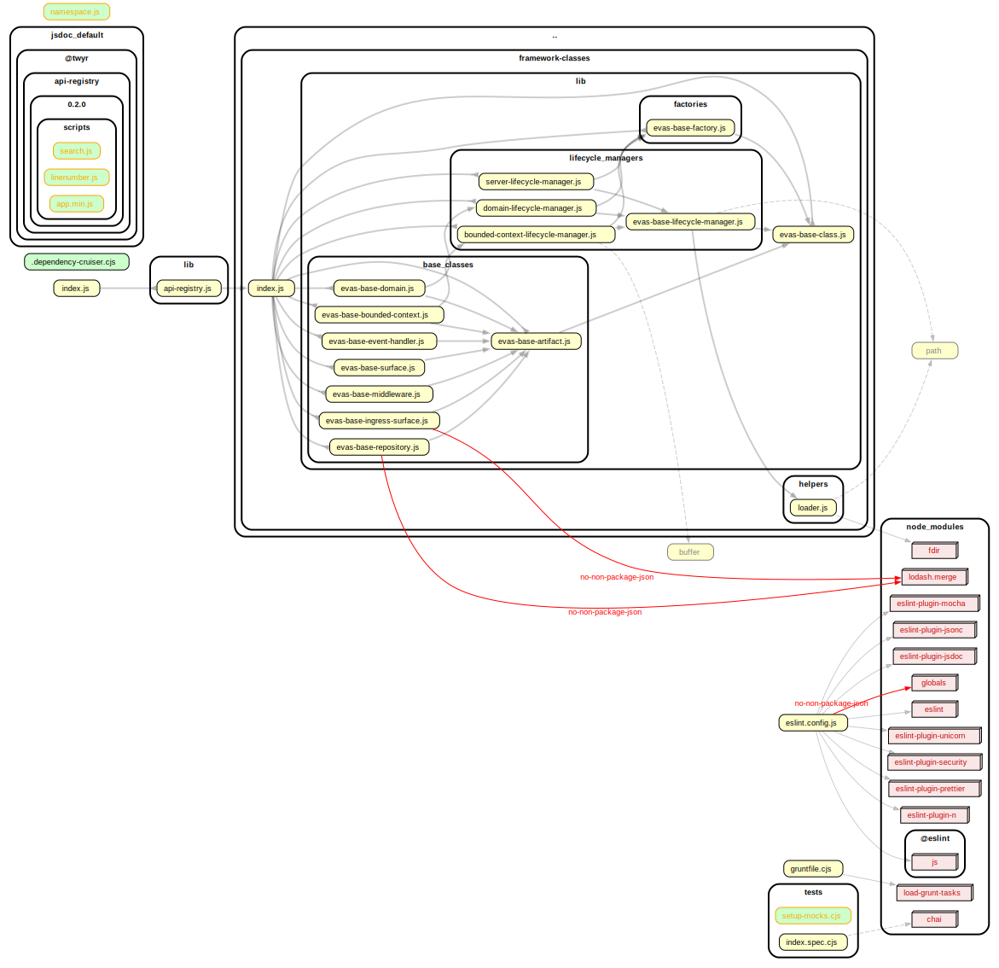

<h1 align="center">
    Entity Value Aggregate Server API Registry
</h1>

    
    

    Code for the API Registry

    Built as part of the <a href="https://github.com/twyr">Twyr</a> V1 effort by <a href="https://github.com/twyr/">Vish Desai</a> and <a href="https://github.com/twyr/entity-value-aggregate-server/graphs/contributors">contributors</a>

